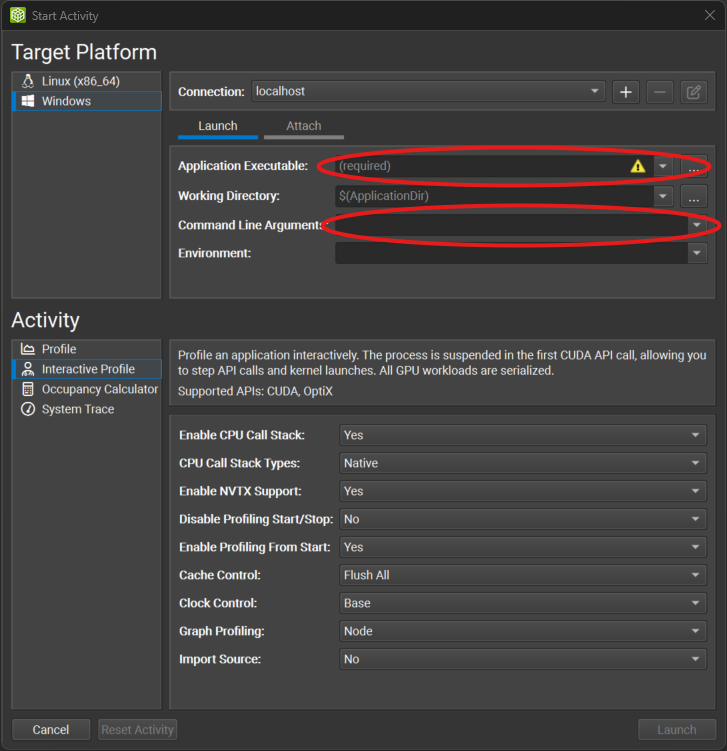
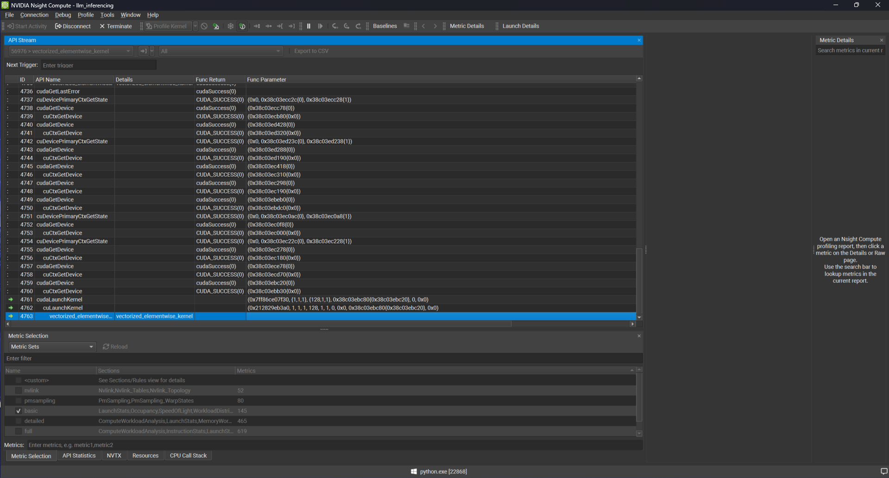
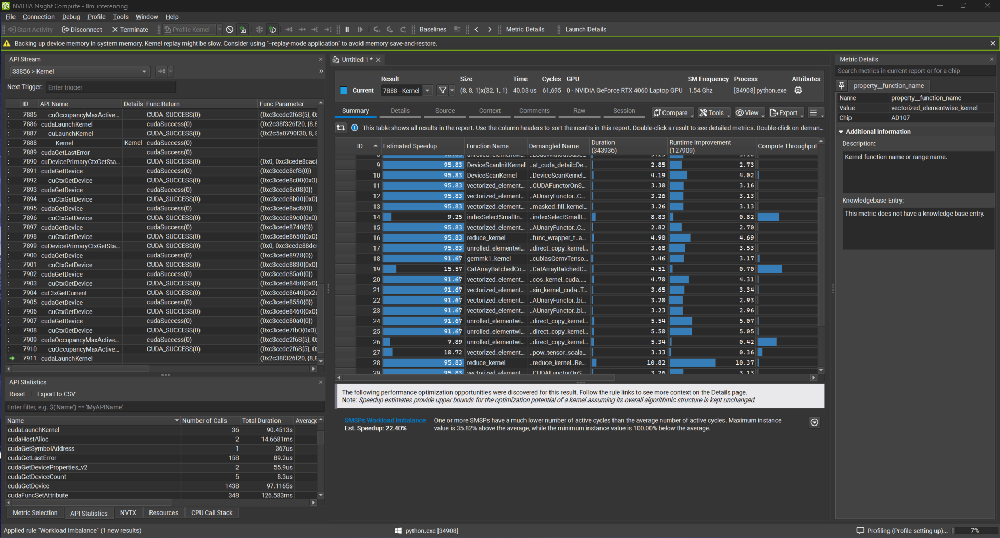
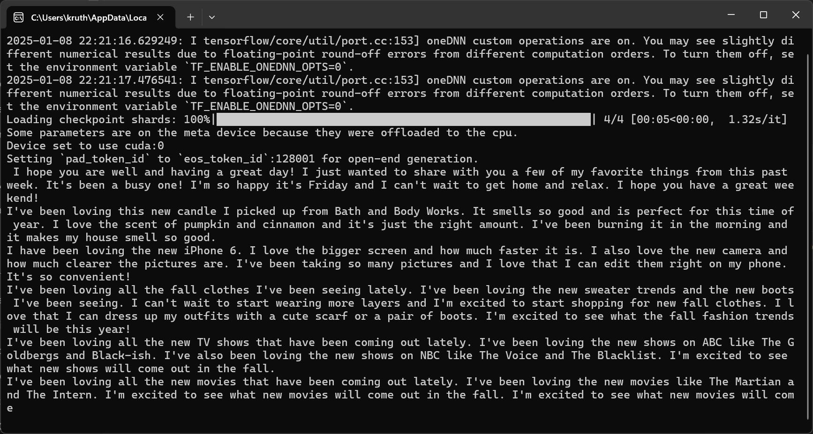

# Project Objectives
- Optimize LLM inference pipelines for GPU-based systems
- Examine improvements in latency, throughput, and resource utilization
- Experiment with techniques in GPU optimization and scalable deployment

# NVIDIA Nsight Compute 
#### Part 1:
1. Step 1:
    Load python exec path and python file path in the encircled regions and press launch.
   

2. Step 2:
    Monitor the profile like you would on an IDE. Image shows different kernels invoked during execution.
   

3. Step 3:
    Monitor output report for the kernel under consideration.
    
    

4. Step 4:
    Check the Python GUI for the output of your code.

    
